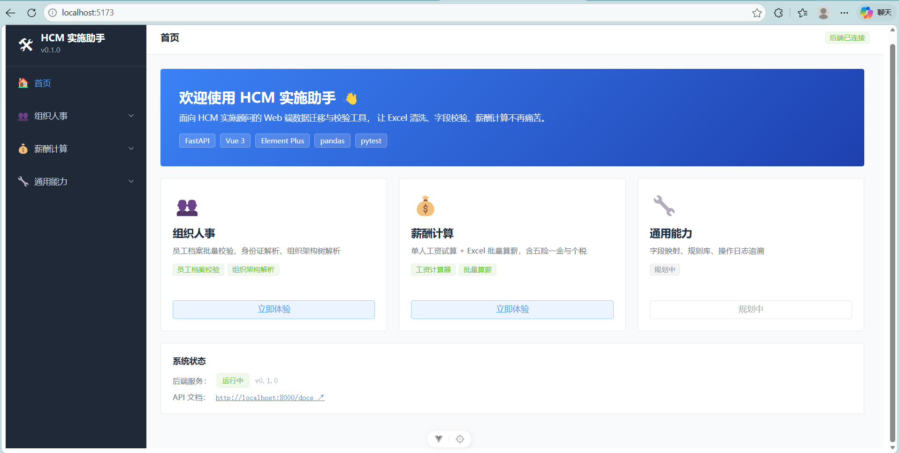
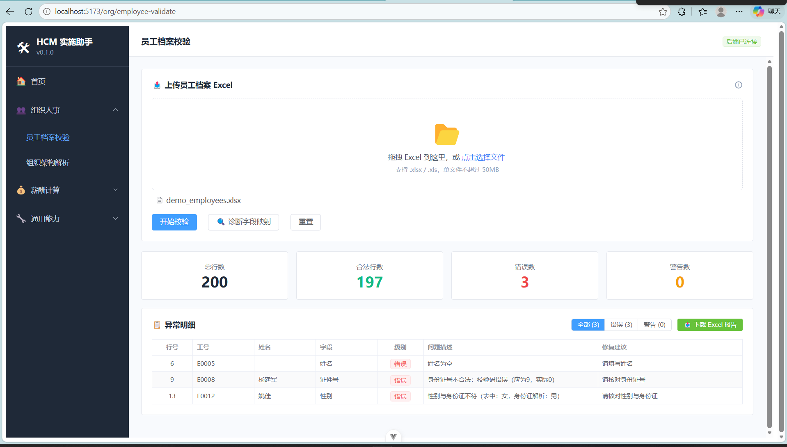
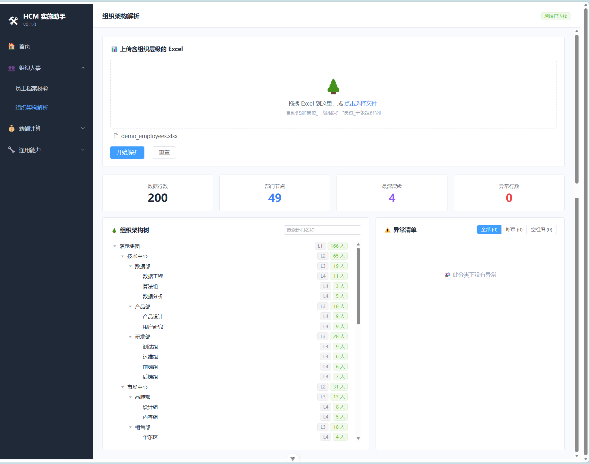
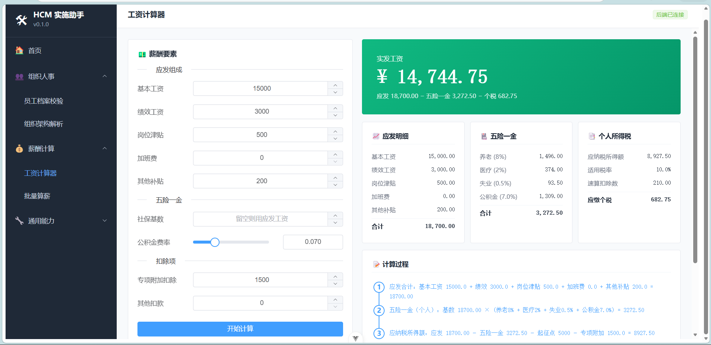
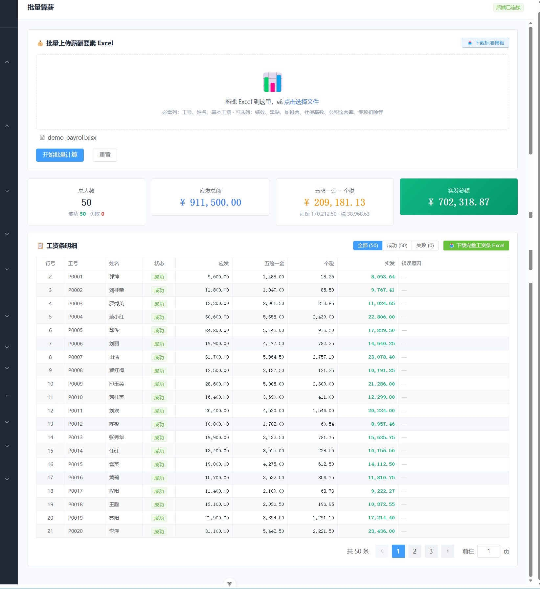

markdown# HCM 实施助手 · HCM Assistant

> 面向 HCM 实施顾问的 Web 端数据迁移与校验工具，让 Excel 清洗、字段校验、薪酬计算不再痛苦。


---

## 📖 项目背景

HCM 系统实施过程中，实施顾问需要反复处理客户提供的"脏数据"——员工档案缺失、身份证与性别不匹配、组织架构混乱、薪酬规则各异……这些工作高频、重复、易出错。

本项目将这些"脏活"工具化，覆盖 HCM 实施核心场景：

- **数据校验**：批量识别员工档案中的字段错误、格式异常、一致性问题
- **组织建模**：扁平员工表自动还原成多级组织架构树
- **薪酬测算**：单人试算 + 批量算薪，含五险一金、个税完整计算链路

---

## 📷 项目预览

### 首页



### 员工档案校验



### 组织架构解析



### 工资计算器



### 批量算薪



---

## ✨ 核心功能

### 🧑‍💼 组织人事

- **员工档案校验**
  - 字段名自适应（"工号 / 员工编号 / employee_id" 都识别）
  - 身份证完整校验：长度、格式、出生日期、校验码、性别推断
  - 字段一致性：性别 vs 身份证解析结果
  - 工号唯一性、手机号、邮箱格式校验
  - 异常分级（error / warning），行号定位，修复建议
  - 校验报告 Excel 导出（总览 + 异常明细）

- **组织架构解析**
  - 扁平表 → 树形 JSON（支持一到十级组织）
  - 节点人数统计（直接 + 子树总人数）
  - 异常检测：路径断层、空组织
  - 前端可视化：可展开折叠的树 + 部门搜索

### 💰 薪酬计算

- **工资计算器（单人）**
  - 应发：基本工资 + 绩效 + 岗位津贴 + 加班费 + 其他补贴
  - 五险一金（个人部分）：养老 8% / 医疗 2% / 失业 0.5% / 公积金 5%–12% 可配置
  - 个税：月度税率表（7 个税率档），完整推导过程展示
  - 实发工资 + 计算过程时间轴

- **批量算薪**
  - 上传 Excel → 批量计算每人工资条
  - 支持错误容错（单行失败不影响整体）
  - 4 项总览统计 + 完整工资条 Excel 下载

> 💡 **金额精度**：所有薪酬计算使用 Python `Decimal` 类型，避免浮点数精度问题（金融行业标准做法）。

---

## 🛠 技术栈

### 后端

| 技术 | 版本 | 用途 |
|---|---|---|
| Python | 3.11+ | 主语言 |
| FastAPI | 0.115 | Web 框架，自动生成 OpenAPI 文档 |
| Pydantic | 2.x | 数据校验、类型安全 |
| pandas | 2.2 | Excel 读写、数据处理 |
| openpyxl | 3.1 | Excel 文件生成 |
| pytest | 8.x | 单元测试 |
| uvicorn | 0.32 | ASGI 服务器 |

### 前端

| 技术 | 版本 | 用途 |
|---|---|---|
| Vue | 3.x | 主框架（Composition API） |
| Vite | 5.x | 构建工具 |
| Vue Router | 4.x | 单页应用路由 |
| Element Plus | 2.x | UI 组件库 |
| Axios | 1.x | HTTP 请求 |

---

## 🚀 快速开始

### 环境要求

- **Python** ≥ 3.11
- **Node.js** ≥ 18
- **Windows / macOS / Linux**

### 1. 克隆项目

```bash
git clone https://github.com/songgeng758-web/hcm-assistant.git
cd hcm-assistant
```

### 2. 启动后端

```bash
cd backend

# 创建虚拟环境
python -m venv venv

# 激活虚拟环境（Windows）
venv\Scripts\activate
# 激活虚拟环境（macOS / Linux）
source venv/bin/activate

# 安装依赖
pip install -r requirements.txt

# 启动服务
uvicorn main:app --reload
```

后端启动后：
- 应用：http://localhost:8000
- Swagger API 文档：http://localhost:8000/docs

### 3. 启动前端

打开**新终端**：

```bash
cd frontend
npm install
npm run dev
```

前端启动后访问：http://localhost:5173

### 4. 生成模板文件

后端启动后，模板会按需自动生成。也可手动生成：

```bash
cd backend
python -m app.utils.gen_template
```

---

## 📁 项目结构
hcm-assistant/
├── backend/                       # 后端
│   ├── app/
│   │   ├── api/                   # API 路由层
│   │   │   ├── org.py             # 组织人事接口
│   │   │   ├── payroll.py         # 薪酬计算接口
│   │   │   └── common.py
│   │   ├── core/
│   │   │   └── config.py          # 全局配置
│   │   ├── modules/               # 业务逻辑层
│   │   │   ├── org/
│   │   │   │   ├── employee_validator.py    # 员工档案校验
│   │   │   │   └── org_tree_parser.py       # 组织架构解析
│   │   │   └── payroll/
│   │   │       ├── calculator.py            # 薪酬计算引擎
│   │   │       └── batch_calculator.py      # 批量算薪
│   │   ├── schemas/               # Pydantic 数据模型
│   │   ├── utils/                 # 工具函数
│   │   │   ├── id_card.py         # 身份证算法
│   │   │   └── validators.py      # 通用校验器
│   │   └── init.py
│   ├── tests/                     # 单元测试（40+ 用例）
│   ├── data/
│   │   ├── templates/             # Excel 模板（提供下载）
│   │   ├── uploads/               # 用户上传文件（不入版本控制）
│   │   └── outputs/               # 报告输出（不入版本控制）
│   ├── main.py                    # FastAPI 入口
│   └── requirements.txt
│
├── frontend/                      # 前端
│   ├── src/
│   │   ├── views/                 # 页面组件
│   │   │   ├── HomeView.vue
│   │   │   ├── EmployeeValidateView.vue
│   │   │   ├── OrgStructureView.vue
│   │   │   ├── PayrollCalcView.vue
│   │   │   └── PayrollBatchView.vue
│   │   ├── router/                # 路由配置
│   │   ├── assets/                # 静态资源
│   │   ├── App.vue                # 主框架
│   │   └── main.js                # 入口
│   ├── package.json
│   └── vite.config.js
│
├── docs/                          # 项目文档
├── .gitignore
└── README.md

---

## 📡 API 接口

启动后端后访问 http://localhost:8000/docs 查看完整的交互式 API 文档（Swagger UI）。

主要接口一览：

### 组织人事

| 方法 | 路径 | 说明 |
|---|---|---|
| POST | `/api/org/employees/validate` | 员工档案校验 |
| POST | `/api/org/employees/inspect` | 字段诊断 |
| POST | `/api/org/structure/parse` | 组织架构解析 |
| GET | `/api/org/templates/employee` | 下载员工档案模板 |
| GET | `/api/org/reports/{task_id}` | 下载校验报告 |

### 薪酬计算

| 方法 | 路径 | 说明 |
|---|---|---|
| POST | `/api/payroll/calculate` | 单人工资计算 |
| POST | `/api/payroll/batch/calculate` | 批量算薪 |
| GET | `/api/payroll/batch/template` | 下载批量算薪模板 |
| GET | `/api/payroll/batch/reports/{task_id}` | 下载批量算薪结果 |

---

## 🧪 测试

后端覆盖了 40+ 单元测试，涵盖核心算法与边界场景。

```bash
cd backend
pytest -v
```

测试模块：

- `test_id_card.py` — 身份证算法（8 个用例）
- `test_org_tree.py` — 组织架构解析（11 个用例）
- `test_payroll.py` — 薪酬计算（14 个用例）
- `test_batch_payroll.py` — 批量算薪（7 个用例）

---

## 🗺 Roadmap

- [x] v1.0 — 员工档案校验
- [x] v1.5 — 单人薪酬计算
- [x] v2.0 — 组织架构解析
- [x] v2.5 — 批量算薪
- [ ] v3.0 — 通用能力（字段映射器、规则库、操作日志）
- [ ] v3.5 — 数据迁移工作流（多模块串联）
- [ ] v4.0 — 用户系统 + 项目管理（多客户、多项目）

---

## 📝 设计说明

### 个税计算

本项目采用 **月度税率表** 进行个税计算（简化版），适合单月试算场景。

完整的"全年累计预扣法"需要追溯年度累计应纳税所得额，实际生产环境的薪酬系统通常采用累计预扣法。本项目作为实施工具，月度税率表已满足试算需求。

### 五险一金费率

各地费率存在差异（例如上海、北京、深圳的医疗保险费率各不相同）。本项目采用常见标准值：

- 养老 8%、医疗 2%、失业 0.5%（固定）
- 公积金 5%–12%（可配置）

如需精确到城市，建议扩展配置文件实现按地区切换。

### 金额精度

薪酬计算全程使用 Python `Decimal`，对外 JSON 接口转换为 `float`。这种设计避免了浮点数累积误差（如 `0.1 + 0.2 != 0.3`），是金融与财务系统的标准做法。

---

## 📜 License

MIT License — 详见 [LICENSE](LICENSE) 文件。

---

**Author**: 宋庚 (Geng Song)

如果这个项目对你有帮助，欢迎 Star ⭐